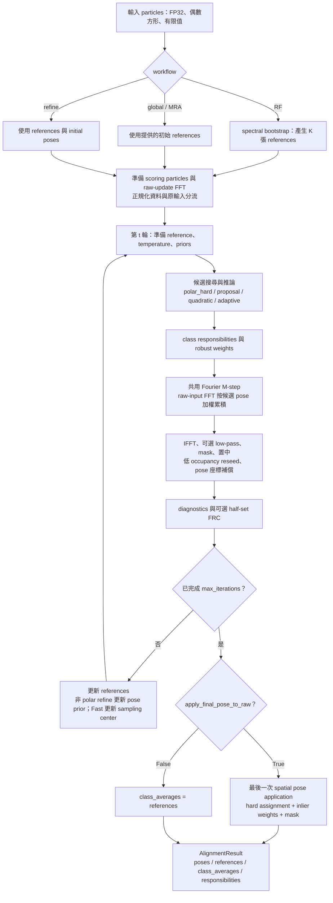
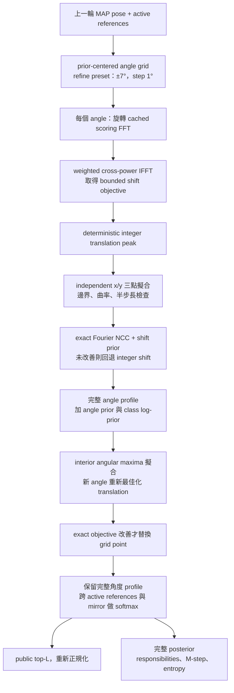
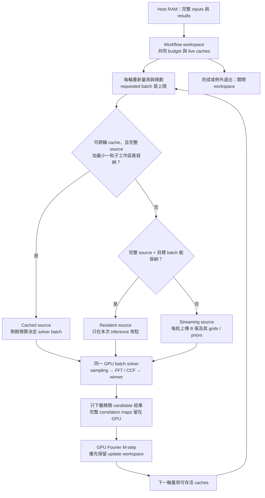

# AlignImg 2.3.1 演算法與數學框架

更新日期：2026-10-08。適用於目前已封存的 2.3.1 spatial-cache 版本；實作對照點為
Git commit `d21f55b`。本文件取代早期的概念草案，區分「統一模型的理解方式」與
「程式真正計算的內容」。歷史驗收仍見 [2.3.1 封版](RELEASE_FREEZE_2_3_1.md) 與
[spatial-cache 封存](RELEASE_FREEZE_POLAR_SPATIAL.md)，不因文件更新而改寫。

AlignImg 的共同核心是：**估計每張 particle 的 pose 與 reference 歸屬，再依這些
估計更新 references，重複指定的迭代次數。** RF、K=1、K>1 MRA 與 class feedback
不是四套互不相干的 engine；它們共享 controller、資料契約與 reference updater，
但可以選擇不同的搜尋及 hard／soft inference 策略。

閱讀順序：先看第 1–3 節的全貌與座標，再看第 4–9 節的評分、搜尋及更新；
第 10–13 節說明輸出、診斷、GPU 與實際呼叫。公式描述目前預設 Fourier 路徑，
歷史 raster／spatial 路徑另行註明。

## 1 統一的是哪些部分

一個 workflow 可以拆成五個選擇：

$$
\text{初始化} \times K \times \text{搜尋與推論策略}
\times \text{reference 更新與輸出估計器} \times \text{backend}.
$$

| 工作 | 輸入 | 實際入口 | 省略 config 時 |
| --- | --- | --- | --- |
| RF | particles 與指定的 K | `reference_free_align` | `reference_free` preset |
| Single-reference／MRA | particles 與 K 張初始 references | `align_to_references` | `global_balanced` preset |
| Local refinement | 上述輸入加上現有 poses | `refine_alignment` | `refine` preset |
| Class feedback | 外部分類資訊轉成 `class_priors` | `make_class_priors` + global 或 refine | 取決於使用的 workflow |
| 單純套 pose | particles 與 poses | `transform_images` | 不搜尋、不迭代、不平均 |

K=1 只代表沒有 class competition；它不會自動決定 hard／soft、global／local。
同一策略下 K=1 與 K>1 共用實作。One-hot priors 可以讓 K>1 的每顆 particle
只對唯一 reference 對齊；quadratic fixed-MRA 有與逐類 K=1 比較的驗收契約。

提供的 reference 是**初始模型**，不是整段固定不動的 template。所有 alignment
workflow 都會更新它。MRA 的 component assignment 是對齊用的歸屬，不等於已驗證的
biological classification；K 也不是由 AlignImg 自動估計。

## 2 整體演算流程

以下是主流程 block diagram。每輪搜尋只選一條策略，不會自動依序跑 Fast、Balanced
再 refine。Backend 配置／分批發生在運算區塊內，沒有額外改變科學策略。



沒有 auto-stop。RF／global 的 `proposal` 每輪重新作 global angular exploration，
不會在後幾輪暗中變成 local refine；Fast 每輪仍搜尋完整角度，但會累積 translation
sampling center。非 polar 的 `refine_alignment` 才逐輪把更新後的 MAP pose 作為
下一輪 pose prior；明確指定 polar hard 不會因 workflow 名稱而變成 local search。

## 3 影像與 pose 的座標契約

輸入是 host RAM 中的 NumPy stack，形狀為 `(N,H,H)`，H 必須為偶數。輸入轉成
FP32；FP16 檔案載入後也升成 FP32 計算。程式不負責讀取原始 micrograph、particle
picking、CTF estimation／correction、denoising 或 3-D reconstruction。

令 $I_i$ 為傳入的第 i 張影像、$R_k$ 為第 k 張 reference，pose 寫成
$g=(\theta,t_y,t_x,m)$。本文的 $T_g I_i$ 一律指 **particle → reference**：

1. 可選的 periodic x mirror。
2. 以 $(H/2,H/2)$ 整數原點做 CCW rotation。
3. 平移 $(t_y,t_x)$；正值分別朝 row／column 增加方向。
4. 使用 periodic／wrap 邊界。

`PoseSet` 的角度單位是度、shift 單位是 pixel，皆以 FP32 儲存，可有小數。
輸出的 pose 是完整 transform，不是應加回舊 pose 的增量。

Mirror 的離散定義為

$$
(MI)[y,x]=I[y,(-x)\bmod H],
$$

即 `np.roll(image[:, ::-1], 1, axis=1)`，不是單純 `image[:, ::-1]`。
Mirror search 預設關閉；開啟時增加可比較的離散假設，不代表新的 3-D projection angle。

Fourier transform 以整數原點的 phase convention 處理旋轉與 mirror；translation 用

$$
\widehat{T_g I}(f_y,f_x)
=\widehat{\mathcal R_\theta M^m I}(f_y,f_x)
\exp[-2\pi\mathrm{i}(f_y t_y+f_x t_x)].
$$

頻率以 cycles/pixel 表示。旋轉使用 centered complex Fourier coefficients 的 periodic
bilinear interpolation，再還原儲存 convention；任意角度的插值仍是數值近似。
`transform_images` 則是 spatial bilinear transform，兩者的幾何契約一致，pixels
不必 bitwise 相同。

整數原點與 RELION 的偶數 box center 相容，**不代表可不經轉換直接套用 STAR 的
angle／origin 欄位**。1.4 的 geometric-center poses 也要用
`convert_v1_4_poses_to_integer_center()` 明確轉換。

## 4 從理想生成模型到目前的 score

### 4.1 潛變量模型是理解方式，不是完整 RELION 實作

一個一般模型可寫成

$$
I_i=C_i T_{g_i}^{-1}R_{k_i}+\varepsilon_i,
\qquad z_i=(k_i,g_i,c_i),
$$

其中 $C_i$ 是 CTF operator，$c_i$ 是可選的 inlier／outlier 狀態；$T_g^{-1}$ 在這裡
表示理想幾何逆變換，不保證對插值後 pixels 可無損逆轉。若完整建模，應由 likelihood
與 priors 推論 $p(z_i\mid I_i,R)$。

目前 AlignImg **沒有**在內部估計 $C_i$、noise-only variance、outlier mixture 或
Fourier regularization prior。需要時由外部提供已處理 CTF、取樣一致的 images。
前處理 CTF correction 不等於數學上 marginalize CTF，也不保證頻率資訊完全恢復或
noise 變白；本引擎只是選擇不再顯式處理這些量。

實作採用 similarity score 驅動的 hard／soft alternating alignment。用 MAP-EM
理解其結構是有幫助的，但不能把 NCC softmax 稱為完整的 RELION Bayesian posterior，
也不能宣稱每輪必然提高某個完整物理 likelihood。

### 4.2 Scoring 與 reference update 使用不同資料

給定 soft circular mask $M$，scoring preparation 為

$$
\mu_i=\frac{\sum_{y,x} M I_i}{\sum_{y,x}M},\qquad
J_i=\frac{(I_i-\mu_i)M}{\max(\|(I_i-\mu_i)M\|_2,\epsilon)}.
$$

這是 **mask 內的加權平均移除與 L2 normalization**，不是 noise-only background
estimation。References 在每輪 scoring 前也經相同 preparation。

| 資料 | 用途 | 更新時機 |
| --- | --- | --- |
| $J_i$ 與 $\widehat J_i$ | scoring／candidate search | particles 固定，engine 開始時準備 |
| Fourier magnitude polar descriptor | Balanced angular proposal、RF bootstrap | prepared stack 建立時 |
| $\widehat I_i$ | Fourier M-step，保留輸入振幅 | engine 開始時另做一次 raw-input FFT |
| $I_i$ | 可選的 final raw average | 最後套一次 MAP pose |
| $R_k$ 與其 prepared representation | 下一輪搜尋目標 | 每輪重新準備 |

因此「只做一次 FFT」的精確意思是：**scoring FFT 與 raw-update FFT 各自快取，
不再為每個候選 pose 重做整張 particle FFT。** 不是整個 workflow 只有一次 FFT。
RF bootstrap 另有 preparation；mirror proposal、polar angular correlation、translation
maps、reference preparation、reference output 與 FRC 也會用到 FFT／IFFT。

### 4.3 Fourier NCC

令 $A_{ig}=\widehat{T_g J_i}$、$B_k=\widehat{J(R_k)}$，$W_i(f)$ 為非負 frequency weights：

$$
S_{ikg}=
\frac{\operatorname{Re}\sum_f W_i(f) A_{ig}(f)\overline{B_k(f)}}
{\max\!\left(\sqrt{\sum_f W_i|A_{ig}|^2\;\sum_f W_i|B_k|^2},\epsilon\right)}.
$$

`fourier_ncc` 在設定頻帶內等權、頻帶外為零，DC 排除；預設最高頻率為 0.35
cycles/pixel。`whitened_fourier_ncc` 則對每顆 particle 的徑向 empirical power
做三點平滑、floor 與倒數加權，再正規化 active-band 平均權重。

Whitening 估的是 **signal + noise 的總 power**，不是單獨 noise spectrum。
它只改 translation search／NCC score，不改 Fourier M-step 的平均公式。
Scoring 的頻帶也不是 M-step 的直接 frequency cutoff。

## 5 Priors 和 hard／soft inference

### 5.1 Class prior 與 local pose prior

Class prior $\pi_{ik}$ 是每列和為 1 的 `(N,K)` 矩陣。未提供時為 uniform；零值
明確禁止該 reference。由外部分類建立 prior 的公式是

$$
\pi_{ik}=\alpha\,p^{\mathrm{external}}_{ik}+(1-\alpha)/K,
\qquad \alpha=\texttt{trust}.
$$

Hard labels 配上 `trust=1` 是 one-hot fixed-class；`trust<1` 讓其他 classes
重新成為可能。Soft responsibilities 先正規化再混合。Prior 在一次 workflow 內
保持固定，**不會每輪自動被新 responsibilities 取代**；下一次 feedback 由 caller 決定。

Refine 的 local pose log-prior 使用 circular angle difference：

$$
\log p(g\mid g_i^0)=
-\tfrac12\left(\frac{\operatorname{wrap}_{[-180,180)}(\theta-\theta_i^0)}{\sigma_\theta}\right)^2
-\tfrac12\left[\left(\frac{t_y-t_{y,i}^0}{\sigma_t}\right)^2+
\left(\frac{t_x-t_{x,i}^0}{\sigma_t}\right)^2\right].
$$

Mirror 是可選搜尋狀態，這裡沒有額外估計 mirror probability prior。Quadratic／adaptive
關閉 mirror search 時保留傳入 prior 的 mirror flag；開啟時比較兩個 states。

### 5.2 實際使用的 objective

$$
a_{ikg}=S_{ikg}/\tau+\log\pi_{ik}+\log p(g\mid g_i^0).
$$

無 pose prior 時最後一項省略。**Temperature 只除 score，不把 class／pose prior
一起除以 temperature**，因此與早期草案的 $\exp(\ell/\tau)$ 必須區分。
降低 $\tau$ 同時改變 score 相對於 priors 的重要性。

Soft inference 在策略實際保留的 support $\mathcal C_i$ 上正規化：

$$
q_i(k,g)=\frac{\exp(a_{ikg}-a_i^{\max})}
{\sum_{(k',g')\in\mathcal C_i}\exp(a_{ik'g'}-a_i^{\max})},
\qquad r_{ik}=\sum_g q_i(k,g).
$$

Hard inference 則只取 deterministic winner $(k_i^*,g_i^*)$，令其 $q=1$。
Hard 有 priors 時仍可作 MAP-like selection；soft 的計算也可以是 deterministic，
並不表示每輪隨機抽 pose。

令退火輪數為 A、iteration index 為 $t=0,\ldots$，當 A>1：

$$
\tau_t=\tau_{start}
\left(\tau_{end}/\tau_{start}\right)^{\min(t/(A-1),1)}.
$$

A=1 直接使用 end temperature。`temperature_anneal_iterations=None` 表示 A 等於
總輪數；指定 A 後可 anneal 再 hold，不會自動停止。

### 5.3 Public top-L 不一定是整個更新用 posterior

| 策略 | 內部更新所用 support | `top_l` 的意義 |
| --- | --- | --- |
| `polar_hard` | 唯一 winner | 必須為 1；responsibility one-hot |
| `proposal` | 排序後的 top-L hypotheses | 改變 inference 與 M-step approximation |
| `adaptive_posterior` | 完整保留的 fine hypotheses | 不截斷一般 local inference 的內部 support |
| `quadratic_refine` | 完整 screened angle profile，每個 angle 一個最佳 translation | 不截斷內部 profile support |

最後兩種策略的 public `CandidateSet.posterior` 會在 top-L 中重新正規化；
`responsibilities`、M-step、`pose_entropy` 與 `map_posterior` 使用完整內部 support。
所以 `top_l=1` **不會**把 adaptive／quadratic 自動改成 hard-EM。
但這不代表 L 對所有輸出都無影響：robust weighting 取 public shortlist 的最高 raw
score，因此改變 L 仍可能改變 inlier weights 與 references；adaptive rescue 的
proposal support 也受 L 影響。
這些有限候選權重也不是對完整連續 pose 空間的精確積分；目前沒有 cell-volume
correction 或由局部曲率估計的 Laplace mass。

## 6 Global 搜尋的兩條路

### 6.1 Balanced proposal 與 Fourier reranking

`proposal` 先從 Fourier magnitude 的 polar descriptor 取得 angular local peaks。
Magnitude 無法區分相差 180° 的方向，因此 shortlist 保留 antipodal pairs，再用
有 phase 的 Cartesian Fourier NCC 分辨。

每個 shortlisted angle 直接旋轉 cached scoring FFT，從 weighted cross-power IFFT
取得 translation map，在限定 shift grid 中挑候選，再用 phase shift 計算確切的 NCC。
各 reference／mirror 的候選加入 priors 排序，保留 top-L 做 soft update。

這是**廣域 proposal + 候選精評**，不是 exhaustive angle×shift 搜尋。`global_accurate`
增加每個 reference 的 angular proposals，但不是另一套 likelihood。
`candidate_scoring="raster"` 仍可明確選用歷史的「raster rotation → FFT」對照路徑。

### 6.2 Fast polar hard search

Fast 用的是 **spatial polar rings**，不是上節的 Fourier magnitude descriptor。
對每個 reference、mirror state 與合法 sampling center，在 $J_i$ 上取極座標 samples。
設安全半徑為 R、radial bin 數為 $J=\max(4,\lfloor R\rfloor)$，第 j 圈實際半徑為
$r_j=Rj/J$。先移除各圈 angular mean、乘上 bin weight $\sqrt{j+1/2}$，再將整個
polar array 做 L2 normalization；不是每圈各自單位化。這個 CCF 不套用
`min_frequency`／`max_frequency` 的 Fourier scoring band。

令其 angular FFT 為 $F_{i,r}(n)$，reference 對應值為 $F_{k,r}(n)$，完整角度 CCF 為

$$
C_{ikc}(\ell)=\operatorname{IRFFT}_{\phi}
\left[\sum_r F_{i,c,r}\,\overline{F_{k,r}}\right](\ell).
$$

每條 curve 取一個全域 integer maximum，符合條件時作 circular 三點 angular
quadratic interpolation。以 fitted CCF score／temperature 加 class log-prior 比較
所有 curves，保留一個 winner；不再做 Cartesian Fourier NCC reranking。
這裡的 fitted score 來自 parabola，不是 quadratic refine 的 exact Fourier rescore。

Translation 是搜尋 sampling center，經座標轉換才成為 `PoseSet` shift。
若相對整數原點的 sampling center 為 $(c_y,c_x)$，以程式慣例：

$$
t_y=\sin\theta\,c_x-\cos\theta\,c_y,\qquad
t_x=-\cos\theta\,c_x-\sin\theta\,c_y.
$$

這裡的 center 在該 mirror hypothesis 的座標中定義，不能把 $c$ 直接當輸出 shift。
首輪從零中心開始，polar hard 不使用 `initial_poses` 作 angle／shift prior；之後
以包含 reference 置中補償的 winning center 為基準搜尋 translation grid，angle
仍全域搜尋。
對 fractional center，先量化採樣座標再映射 mirror 的讀取 indices，保留 CPU authority。
Reference 置中位移為零時不重算 center，避免無意義 round-trip 改變量化結果。

`fast3` 固定三輪、關閉 fast-stage half-set diagnostics、啟用 final raw average。
它沒有自動 refine。Winner margin 是最佳與 runner-up curve candidates 的 objective
差，不應解讀為完整 angular posterior 的不確定度。

## 7 Continuous quadratic refinement

這條路把昂貴的 dense angle×x×y grid，改成「每個 angle 先最佳化 translation，
再沿 angle profile 局部擬合」。它是 bounded local profile optimization，沒有 Adam、
反向傳播或反覆 gradient descent，也不是完整 Hessian 的 2-D Newton method。

### 7.1 用一張 correlation map 同時計算整數 shifts

固定 angle、reference、mirror 後，令 $A$ 為旋轉後的 scoring FFT，則

$$
C=H^2\operatorname{Re}\operatorname{IFFT2}
\left[W_i A\overline{B_k}\right].
$$

整數 shift $(t_y,t_x)$ 的 NCC 從 $C[-t_y\bmod H,-t_x\bmod H]$ 除以 NCC norms
取得；負號來自相關 lag 與「把 particle 移至 reference」的方向差。
加入 Gaussian shift prior 後，在 prior shift 附近的整數位置找最大值。
初始 shift 可有小數，不必先把 initial pose 四捨五入。若極窄的 window 內沒有任何
整數位置，目前退回最接近 prior 的整數點；該 fallback 可能超出名義上的 window。

### 7.2 三點 parabola 的閉式解

對等距 samples $v_-,v_0,v_+$，間距 h，頂點相對中心的 offset 是

$$
d=v_- -2v_0+v_+,\qquad
\delta=\frac{h}{2}\frac{v_- - v_+}{d}.
$$

目前分別沿 x、y 用三點擬合 objective；兩軸共用中心，因此只需要中心加上下左右
五點。接受條件包括有限值、負且非退化的曲率、$|\delta|\le h/2$，以及該軸 peak
不在 local window 邊界。退化／凸面／超界時該軸保留 integer peak。

得到 $(t_y^{fit},t_x^{fit})$ 後，以真正的 Fourier phase 與 NCC **一起重新評分**。
若 combined score＋shift prior 沒有改善，兩軸退回整數 peak。這能防止 independent
x/y 擬合忽略交互項後，提出看似合理卻較差的 pose。

### 7.3 沿 angle profile 再擬合

Refine preset 在 prior angle 周圍 ±7°，每 1° screening，通常為 15 個 angles。
每個 angle 先完成上面的 translation optimization，再加 angle prior，形成 profile。
對 deterministic interior local maxima 做相同三點擬合；boundary maximum 保留離散角度。
擬合的新 angle 會**重新最佳化 translation**，只有精確 objective 改善才取代原 grid point。



最重要的差異是：**不是只讓 angular maxima 進 posterior。** 其餘 screening points
仍留在內部 support；擬合只替換其中的 peak point。Translation 每個 angle 只保留
一個局部 optimum，因此仍不是對所有 translations 的完整 marginalization。
本路徑不自動擴大 window、不啟用 adaptive rescue，也不加入 $cxy$ Hessian fitting。
`coarse_shift_step`、`adaptive_fraction`、`oversampling_order` 與 `max_adaptive_cells`
不是 quadratic 的控制項；translation fitting 使用 1 pixel 鄰點間距。

### 7.4 保留的 adaptive posterior

`adaptive_posterior` 仍可明確指定：先評估 prior-centered coarse angle／shift cells，
以累積 posterior mass 達 `adaptive_fraction` 為目標選 cells；若碰到
`max_adaptive_cells`，實際涵蓋 mass 可較低。再依 oversampling 展開、
精評所有 fine hypotheses。Fine support 而非 public top-L 用於更新。

它可選配既有的 bounded rescue scheduler：不確定 particles 在後續一輪嘗試 global
proposal，只有 score 改善才接受，最後一輪保留 local confirmation。此機制不是
quadratic 或 Fast 的隱藏步驟，也沒有擴張成無限次 outlier rescue。

## 8 Reference-free 初始化

RF 不等於「用全體 raw mean 當唯一 reference」。目前流程為：

1. 準備 Fourier magnitude polar descriptors。
2. 對角度做 harmonic transform，取非 DC 的低階 harmonic magnitudes 作為近似
   rotation-invariant features，再逐 feature 標準化。
3. 用指定 `random_seed` 作 k-means++ 選點，再以 cluster centroid 鄰近的 medoid 更新。
4. 每群 particles 先以 polar angular proposal 對到 medoid，平均後 low-pass，產生 K 張初始 references。
5. 進入 caller 指定的同一套迭代 engine；bootstrap labels 記錄在 metadata，**不是**
   後續固定的 class prior，RF 主流程從 uniform class prior 開始。

未指定 positive `lowpass_sigma` 時，bootstrap 使用 sigma=2 pixel 的 Gaussian blur；
這不代表後續每輪也自動採用相同 filter。RF 的 random seed 與輸入順序影響初始化，
驗證時必須一併固定。

K 太少、不同 projection views 混在同一 component、初始化品質或 SNR 都會影響結果。
Soft assignment 不保證短短幾輪收斂，也不保證 components 不會吸引到相似內容。

## 9 共用 reference update

### 9.1 Robust weights 是 heuristic，不是顯式 outlier posterior

先取每顆 particle 的 public retained candidates 中最高 raw score $s_i$。
關閉 `robust_weighting` 時 $w_i=1$；開啟時：

$$
b=\operatorname{quantile}(s,1-\texttt{keep_fraction}),\qquad
a=\max(\texttt{weight_temperature},0.25\operatorname{std}(s),10^{-6}),
$$

$$
w_i=\operatorname{sigmoid}\!\left(\operatorname{clip}((s_i-b)/a,-80,80)\right).
$$

`keep_fraction` 決定 sigmoid 中點，不是硬切掉固定比例的 particles。
一般情況在全體 particles 上估 b、a；quadratic fixed-class refinement 則在各 fixed
class 內分別估計，維持 joint fixed-MRA 與逐類 K=1 的契約。

### 9.2 Fourier M-step 的實際平均

令 raw-input FFT 為 $X_i=\widehat I_i$，候選有效權重為
$\omega_{ikg}=w_i q_i(k,g)$，則濾波與置中之前：

$$
D_k=\sum_{i,g}\omega_{ikg},\qquad
\widehat R_k^{new}(f)=
\frac{\sum_{i,g}\omega_{ikg}\,\widehat{T_g I_i}(f)}{D_k}.
$$

Hard inference 使每顆 particle 只貢獻一個 pose／class；soft inference 將貢獻分散到
多個 hypotheses。Scoring 的 $W_i(f)$ **不乘進這個 M-step 分子／分母**。
這不是 CTF／noise-weighted Wiener reconstruction，也沒有另加 regularization denominator。

每個 reference 做 output IFFT 後，依序做可選 Gaussian low-pass、circular mask、
可選置中。置中採 $|R_k|$ 的質心，以 `np.round` 取最近整數（半整數取偶數）再
`roll`；candidate shifts
也加上同一個 class center correction，避免 reference 和 pose 失去共同座標。

因此這是 EM-like alternating update，不是 NCC objective 的精確 M-step 求解器。
改變 candidate support、插值、mask 或 robust weight 都可能改變 reference trajectory；
不應宣稱完整 likelihood 每輪必然單調上升。

### 9.3 低 occupancy 的現行行為

若 $D_k<\max(1,0.01N/K)$，controller 用 class-responsibility entropy 排序選出的
prepared particle，deterministically reseed 該 reference，並記錄 `reseeded_components`。
這是已有的退化處理，不是 automatic K、merge／split 或強制均衡 class occupancy；
也不會直接把 particles 改派給 reseeded class。

## 10 References 與最後輸出的 class averages

`references` 是最後一輪更新與必要 reseed 完成後的模型。最後一次候選搜尋使用的
是該輪更新前的 references；更新後不會額外再跑一次候選搜尋。Fast 時是 hard
update，Balanced／quadratic 時是 soft update，不能把這個欄位一概稱為 soft reference。

`apply_final_pose_to_raw=False` 時，`class_averages` 等於 `references`。
為 True 時，演算完成後才額外計算

$$
A_k=M\odot
\frac{\sum_{i:\hat k_i=k}w_i\,T_{\hat g_i}^{spatial}I_i}
{\sum_{i:\hat k_i=k}w_i}.
$$

這裡使用 final MAP pose、hard output assignment 與 inlier weights，走 spatial
bilinear transform，沒有額外 low-pass 或 scoring normalization；空 class 保留原 reference。
它不回饋下一輪 inference，因為這次 workflow 已結束。若 caller 要拿它當下一次
reference，需自行傳入。

這裡的 raw 只表示 **傳入這次呼叫的 `images`**。若它已經 denoised，這個選項
不會自動找回磁碟上的原始影像。要套到另一份 raw stack，須由 caller 保持相同
particle 順序、box size 與座標框架，再使用 `transform_images`。

Hard raw average 對每顆 particle 只套一個 pose，可能比 soft pose averaging 更銳利；
同時也承受選錯單一 pose 的風險。兩者還有 Fourier／spatial interpolation、filter
與 masking 的差異，不能單憑視覺 contrast 判定哪個一定更接近 truth。

另一個重要輸出細節：`poses` 取 joint candidate posterior 的最大值；
`reference_assignments` 取 marginal responsibility 最大的 class。
Soft K>1 時，最高單一 candidate 的 class 與累積最多 probability 的 class **可能不同**。
Final raw average 依照這兩個 public 欄位組合輸出，不另外重新估 assigned-class pose；
Fast hard 或 fixed-class 沒有這個 class-choice 歧異。分析 ambiguous soft MRA 結果時，
應一併檢查 candidates／responsibilities，而不是假設兩者一定來自同一 joint mode。

## 11 Diagnostics 能證明什麼

每輪記錄 score／objective、pose uncertainty、effective occupancy、reference change、
center shifts 與 strategy-specific 計數。它們用來觀察流程，不會自動觸發 Fast →
Balanced → refine 升級。

啟用 half-set diagnostics 時，以固定 seed 將 particles 分成兩半，在共用的 inference
結果下分別累積 averages。Fourier ring correlation 為

$$
\mathrm{FRC}(r)=
\frac{\operatorname{Re}\sum_{f\in r}\widehat R_A(f)\overline{\widehat R_B(f)}}
{\max\!\left(\sqrt{\sum_{f\in r}|\widehat R_A|^2\sum_{f\in r}|\widehat R_B|^2},10^{-12}\right)}.
$$

這是 2-D rings，本文使用 FRC 而非 3-D shells 的 FSC。Half averages 只供診斷，
**沒有**各自獨立 refinement，也沒有用 opposite-half reference scoring，FRC 不會
自動決定 reference low-pass。不能把它當成完整 gold-standard validation。

同時保留 raw curve、legacy 最後一個 ≥0.143 的 ring，以及 stable cutoff：
先用 `[0.25,0.5,0.25]` 平滑，再找連續三圈低於 0.143 的第一處，可能時在 crossing
間插值。未找到 crossing 時回報最後可用 ring，不代表測得精確的物理解像度。

Real-data validation tools 將任一 half effective weight <10 的 component 排除於
可靠的 stable-resolution median；這是 **report 層的可靠性標記**，不是 engine
強制合併 class。物理 resolution 換算為 pixel size／cutoff，仍需上述限制。

Reproducibility 也有層次：固定 seed、inputs、backend、batch／policy 可檢查同條件
重跑；CPU／CuPy／CUDA 或跨 batch 比較使用 frozen numerical tolerances，並非要求
bitwise 一樣。RF 的 gauge、reference permutation 與外部 pose comparison 要先對齊。

## 12 GPU 與記憶體資料流

CPU 提供完整權威實作；CUDA backend 是 **native kernels + CuPy／cuFFT + Python
controller** 的混合架構，不是所有工作都變成單一 CUDA program。CuPy backend
使用 portable kernel 路徑，科學契約相同。指定 `cuda`／`cupy` 不可用時報錯；
`auto` 在 dispatch 時選 CUDA → CuPy → CPU，不表示執行中 OOM 會改用 CPU。

下圖及 source storage／inference recovery 說明針對 `polar_hard`；Fourier M-step
與 final raw average 各自另有分批與 OOM recovery。



`memory_fraction=0.8` 是配置預算 policy；requested `batch_size=512` 是上限，
不是保證每批一定有 512 顆。實際 B 取決於 box、angles、translation centers、K、
live caches、cuFFT workspace 與當前 free VRAM。不是只有尾批才可能小於 512。
Fixed-class 可減少實際 correlation 計算，但 polar planner 仍採與 open-class 相同
的保守 inventory。GPU streaming 不等於磁碟 streaming；host inputs 仍可為 O(N)。

共同預算取 workflow 尚餘額度與當前可配置 VRAM 的較小值；free VRAM 已反映的
cache 不會再重複扣款。不可行的 batch-1 plan 在 upload 前報錯；真正 allocation OOM
才進 recovery，依序處理 resident → streaming、可重建 cache 釋放、batch 減半，
最低 batch 仍失敗則退出，不更換搜尋方法。Polar recovery 重試整次候選搜尋；
成功返回後才進 M-step，不會因候選搜尋重試而重複累加更新。

已封存的 spatial-cache extension 只重用 **prepared、masked、normalized particles**，
在同一次多輪 polar／Fourier-update workflow 內存活；不是 raw stack，不供 final
raw average 共用，也不跨 workflow。每輪 reference 與 grids 仍更新。若它排擠 M-step
或新一輪預算不足，會被釋放，之後本 workflow 不反覆 admission。

Cache 可以少傳資料，不保證所有 workload 都更快。VRAM estimates、CuPy pool peak
與 device-memory samples 必須分開看，不能把配置估計當作硬體連續峰值證明。
`profile_execution=True` 是選用觀測，完整驗證 runner 的反覆 A/B、hash 與 comparison
不在一般 alignment 主迴圈裡。

主要影像與 FFT cache 是 FP32／complex64；部分計算、判斷與累積保留 FP64／
complex128。不是全 FP64，也不是 FP16 tensor-core inference；精度政策不因這次
文件更新而改變。數值細節以各 backend 實作與 conformance 為準。

## 13 如何組合成自己的流程

### 13.1 實際 presets

下表為 preset 本身的設定，不是效能或精度保證：

| Preset | Search | 輪數 | Public L | Temperature | Robust | Half-set | Raw average |
| --- | --- | ---: | ---: | --- | --- | --- | --- |
| `fast3` | polar hard | 3 | 1 | 0.08 → 0.05 | 否 | 否 | 是 |
| `fast_hard` | polar hard | 10 | 1 | 0.08 → 0.05 | 否 | 否 | 否 |
| `global_balanced` | proposal，6 angles/ref | 10 | 8 | 0.08 → 0.05 | 否 | 是 | 否 |
| `global_accurate` | proposal，8 angles/ref | 10 | 8 | 0.08 → 0.05 | 否 | 是 | 否 |
| `reference_free` | proposal，4 angles/ref | 10 | 4 | 0.08 → 0.02，前 10 輪退火 | 否 | 是 | 否 |
| `refine` | quadratic，±7° / step 1° / ±3 px | 5 | 8 | 0.08 → 0.05 | 是 | 是 | 否 |

Hand-built `AlignmentConfig()` 不等於 refine preset；即使傳給 `refine_alignment`
也不會自動把 strategy 換成 quadratic。若希望調整預設 refine，從
`AlignmentConfig.preset("refine")` 用 `dataclasses.replace` 修改最清楚。

### 13.2 Global 後做 fixed-class refinement

以下假定 `images` 與 `initial_references` 已載入且符合第 3 節契約：

```python
from dataclasses import replace
import alignimg as ai

backend = "cpu"  # 有已驗證的 native GPU 安裝時可改為 "cuda"
global_result = ai.align_to_references(
    images, initial_references,
    config=ai.AlignmentConfig.preset("global_balanced"), backend=backend,
)
fixed = ai.make_class_priors(
    assignments=global_result.reference_assignments,
    n_components=len(global_result.references), trust=1.0,
)
refined = ai.refine_alignment(
    images, global_result.references, global_result.poses,
    class_priors=fixed,
    config=replace(ai.AlignmentConfig.preset("refine"), max_iterations=2),
    backend=backend,
)
poses = refined.poses
averages = refined.class_averages
```

RF 只把上面的 global 起點換成 `reference_free_align(images, n_components=K, ...)`。
若要 corrective feedback，改用外部分類的 responsibilities 與例如 `trust=0.9`
建立 prior；它允許改派，不要求一定有人改派。

Fast 3 可作前期頻繁的探索／回饋；在重要 checkpoint 明確跑 Balanced，需要局部
精修時再呼叫 refine。**不要假設 Fast 後接兩輪 refine 必然恢復 Balanced 的品質**，
因為 local window 不會重新探索所有 global alternatives。是否切換由 caller 決定，
不是新增一個自動 scheduler。

## 14 與早期文件相比需要改正的理解

| 早期容易形成的印象 | 現在的正確理解 |
| --- | --- |
| RF、MRA、MAP-EM 是不同引擎 | workflow 與 K 共用 controller；搜尋／scorer 有明確分支 |
| 所有 polar 都是同一件事 | Balanced 用 Fourier magnitude proposal；Fast 用 spatial ring CCF |
| MAP-EM 就是完整 RELION | 現在是 NCC／CCF 加 priors 的 alternating inference，無完整 CTF/noise likelihood |
| 整個流程只 FFT 一次 | scoring/raw-update 各自快取，仍有 reference、map、polar、diagnostic FFTs |
| top-L 永遠決定 soft update | adaptive／quadratic 有更完整的內部 support |
| quadratic 只保留 maxima | fitted peak 替換 grid point，完整角度 profile 仍參與 soft update |
| reference 都是 soft averages | polar hard 用 hard update；輸出 estimator 又可另選 raw average |
| FRC 會自動濾波或防止 bias | 現行只做共享 inference 下的 half-set 診斷 |
| CTF corrected 就等於完全 CTF-free | 前處理只是輸入契約，不補回所有頻率資訊或建立 noise model |
| GPU batch 永遠是固定 512 | 512 是上限，planner 與 recovery 可縮小 batch |

未包含的功能仍是：automatic K、class merge／split、occupancy regularization、
biological classification、auto-stop、無限 rescue、完整 CTF-aware likelihood、
多 GPU 及 disk streaming。現有低 occupancy reseed 不等於上述 class-management 功能。

## 15 從文件回到實作

| 主題 | 實作入口 |
| --- | --- |
| Workflow dispatch、final raw average | [`workflows.py`](../src/alignimg/workflows.py)：`reference_free_align`、`_finalize_class_averages` |
| Presets、驗證與輸出欄位 | [`models.py`](../src/alignimg/models.py)：`AlignmentConfig`、`AlignmentResult` |
| Preparation、Fourier NCC、proposal | [`_fourier.py`](../src/alignimg/_fourier.py)：`prepare_stack`、`infer_top_candidates` |
| Fourier pose transform | [`_fourier_native.py`](../src/alignimg/_fourier_native.py)：`transform_fourier_cpu` |
| Fast polar hard | [`_polar_hard.py`](../src/alignimg/_polar_hard.py)：`infer_polar_hard_candidates_cpu` |
| Continuous refine | [`_quadratic.py`](../src/alignimg/_quadratic.py)：`quadratic_vertex_offset`、`infer_quadratic_candidates` |
| Adaptive compatibility | [`_adaptive.py`](../src/alignimg/_adaptive.py)：`infer_adaptive_candidates_cpu` |
| Iteration、priors、bootstrap、M-step、FRC | [`_engine.py`](../src/alignimg/_engine.py)：`run_soft_alignment_cpu` |
| GPU solver 與 controller hooks | [`backend.py`](../packages/alignimg-gpu/src/alignimg_gpu/backend.py) |
| GPU inventory、cache 與生命週期 | [`_polar_memory.py`](../packages/alignimg-gpu/src/alignimg_gpu/_polar_memory.py)、[`_workspace.py`](../packages/alignimg-gpu/src/alignimg_gpu/_workspace.py) |

參數與回傳形狀見 [API](API.md)，可直接執行的讀檔與儲存範例見 [README](../README.md)。
複習時只要依序問：reference 從哪裡來、K 是多少、score 是哪一種、保留哪些 hypotheses、
最後輸出是哪一個平均估計器，就能把各種操作放回同一套架構。
